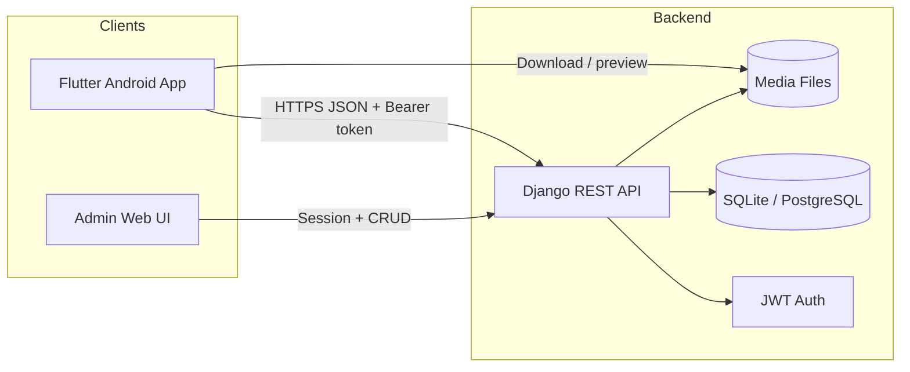
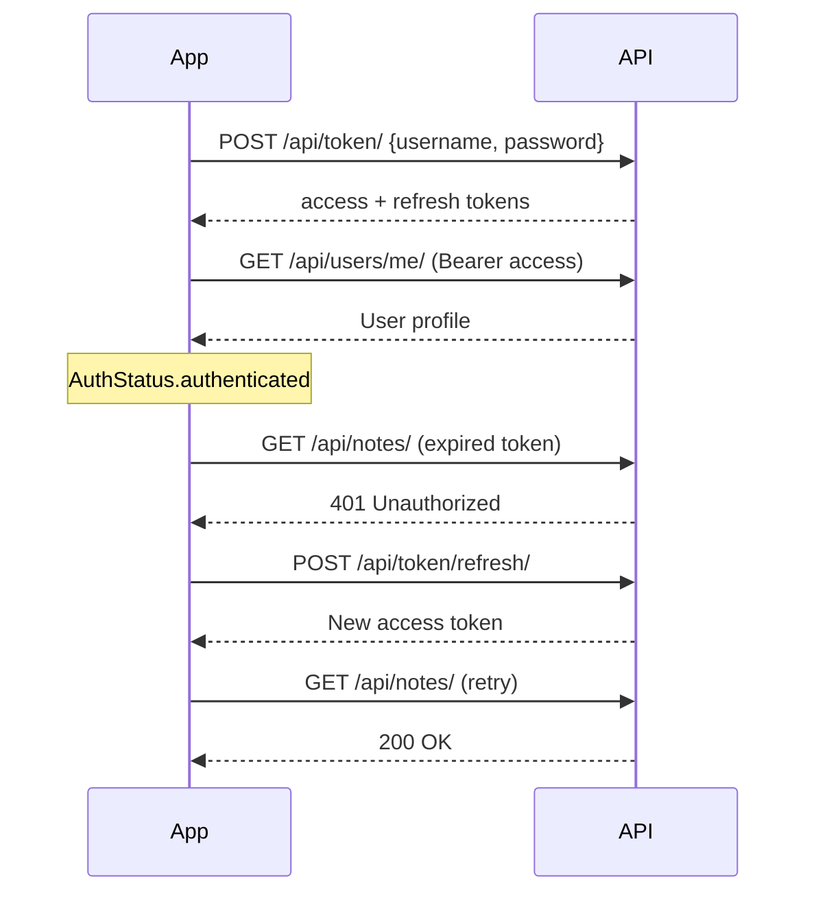
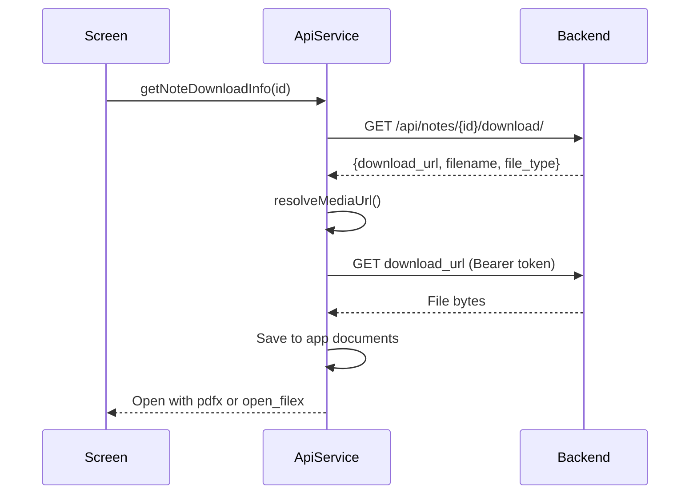

# Campus Portal — Technical Documentation

**Version:** 1.0  
**Last updated:** May 2026  
**Repository:** `Compus_portal`

---

## Table of contents

1. [System overview](#1-system-overview)
2. [Architecture](#2-architecture)
3. [Technology stack](#3-technology-stack)
4. [Project structure](#4-project-structure)
5. [Backend (Django REST API)](#5-backend-django-rest-api)
6. [Frontend (Flutter mobile app)](#6-frontend-flutter-mobile-app)
7. [Authentication & authorization](#7-authentication--authorization)
8. [File storage & media handling](#8-file-storage--media-handling)
9. [Notifications](#9-notifications)
10. [Admin dashboard](#10-admin-dashboard)
11. [Installation & setup](#11-installation--setup)
12. [Deployment considerations](#12-deployment-considerations)
13. [Development guide](#13-development-guide)
14. [Test data & accounts](#14-test-data--accounts)
15. [Known limitations & roadmap](#15-known-limitations--roadmap)

---

## 1. System overview

Campus Portal is a **campus management platform** consisting of:

| Component | Role |
|-----------|------|
| **Django REST API** | Central backend: users, academic content, support, analytics |
| **Flutter Android app** | Student/lecturer mobile client |
| **Custom Django Admin** | Staff web console with Chart.js analytics |

### Primary goals

- Student registration, login, and profile management
- Distribution of **course notes**, **assignments**, and **e-library books**
- Study group–based content visibility
- Academic performance (**grades**) and **attendance** tracking
- **Support tickets** between students and administration
- **Announcements** with mobile local notifications
- Role-based access for **students**, **lecturers**, and **staff**

### High-level data flow



---

## 2. Architecture

### 2.1 Architectural style

- **Monolithic Django backend** exposing a REST API under `/api/`
- **Thin mobile client** — business rules enforced server-side; client handles UI, caching, and offline file storage
- **JWT stateless authentication** with refresh tokens stored on device
- **Group-scoped content** — notes and assignments visible only to students in linked study groups

### 2.2 Layering (backend)

```
campus_portal/          # Project settings, URLs, custom admin site
api/
  models.py             # Domain models
  serializers.py        # DRF serializers
  views.py              # Core viewsets (users, books, support, students)
  group_views.py        # Departments, courses, groups, notes, assignments
  student_views.py      # Announcements, grades, attendance, dashboard
  auth_views.py         # Student registration
  auth_serializers.py   # JWT login (username or email)
  permissions.py        # Custom DRF permissions
  urls.py               # API router
  admin.py              # Model admin registration
  dashboard_context.py  # Chart data for admin home
  group_utils.py        # Auto-assign students to study groups
  utils.py              # File type validation
  pagination.py         # Standard page size (20)
```

### 2.3 Layering (frontend)

```
lib/
  main.dart                 # App entry, providers, auth gate
  config/app_config.dart    # API host (platform + persisted override)
  core/api_exception.dart   # Typed API errors
  providers/
    auth_provider.dart      # Login, register, session bootstrap
    shell_navigation_provider.dart
  services/
    api_service.dart        # HTTP client, JWT, all endpoints
    notification_service.dart
  screens/                  # Feature screens
  widgets/                  # Reusable UI (banners, lists, forms)
  theme/app_theme.dart
  utils/                    # Pagination, responsive layout
```

---

## 3. Technology stack

### Backend

| Technology | Version / notes |
|------------|-----------------|
| Python | 3.x |
| Django | 5.2.x |
| Django REST Framework | JWT via `djangorestframework-simplejwt` |
| django-cors-headers | Permissive CORS for mobile dev |
| SQLite | Default dev database (`backend/db.sqlite3`) |
| Pillow | Image uploads (profiles, book covers) |

### Frontend

| Technology | Version / notes |
|------------|-----------------|
| Flutter | SDK ^3.11.5 |
| Dart | ^3.11.5 |
| provider | State management |
| http | REST client |
| shared_preferences | Token + server URL persistence |
| pdfx | In-app PDF preview |
| open_filex | Open downloaded files with system viewer |
| path_provider | App documents directory for downloads |
| file_picker | Lecturer uploads |
| flutter_local_notifications | Announcement alerts on device |
| permission_handler | Android notification permission |

### Admin UI

- Custom `CampusAdminSite` with Chart.js dashboard template
- CRUD for all domain models

---

## 4. Project structure

```
Compus_portal/
├── backend/
│   ├── campus_portal/       # Django project (settings, urls, admin_site)
│   ├── api/                 # Main application
│   ├── templates/admin/     # Dashboard templates
│   ├── static/              # Admin static assets
│   ├── media/               # Uploaded files (runtime)
│   ├── db.sqlite3           # Dev database
│   └── manage.py
├── frontend/
│   └── campus_app/          # Flutter project
│       ├── lib/
│       ├── android/
│       └── pubspec.yaml
├── docs/
│   └── TECHNICAL_DOCUMENTATION.md
└── README.md
```

---

## 5. Backend (Django REST API)

### 5.1 Domain model

```mermaid
erDiagram
    User ||--o| Student : has
    User ||--o| Lecturer : has
    Department ||--{ Course : contains
    Department ||--{ Student : enrolls
    Course ||--o{ Student : enrolls
    Department ||--{ StudyGroup : has
    Course ||--{ StudyGroup : has
    User ||--o{ StudyGroup : teaches
    StudyGroup }o--o{ Student : members
    StudyGroup }o--o{ Note : scoped_to
    StudyGroup }o--o{ Assignment : scoped_to
    Student ||--{ SupportRequest : submits
    Student ||--{ Grade : receives
    Student ||--{ AttendanceRecord : has
    Course ||--o{ Grade : for
    Course ||--o{ AttendanceRecord : for
    User ||--o{ Note : uploads
    User ||--o{ Assignment : posts
    Book ||--|| file : stores
    Note ||--o| file : stores
    Assignment ||--|| file : stores
```

#### Entity summary

| Model | Purpose | Key fields |
|-------|---------|------------|
| `Department` | Academic faculty | `name`, `code` |
| `Course` | Program within department | `department`, `name`, `code` |
| `Student` | Student profile linked to `User` | `student_id`, `department`, `course`, `profile_picture` |
| `Lecturer` | Lecturer profile linked to `User` | `department` |
| `StudyGroup` | Class/cohort unit | `department`, `course`, `lecturer`, M2M `students` |
| `Note` | Course material | `file`, M2M `groups`, `uploaded_by` |
| `Assignment` | Task with due date | `file`, `due_date`, M2M `groups`, `lecturer` |
| `Book` | E-library entry | `file`, `cover_image`, `author` |
| `SupportRequest` | Help desk ticket | `student`, `subject`, `issue`, `status`, `staff_response`, `responded_by`, `responded_at` |
| `Announcement` | Broadcast message | `title`, `body`, `priority`, `audience`, `expires_at` |
| `Grade` | Assessment result | `student`, `course`, `score`, `max_score`, `term` |
| `AttendanceRecord` | Daily attendance | `student`, `course`, `date`, `status` |

#### Automatic group membership

Signals in `models.py` call `group_utils`:

- When a **Student** is saved → added to all `StudyGroup` rows matching their `department` + `course`
- When a **StudyGroup** is saved → all matching students are added to that group

### 5.2 API base URL

```
http://<host>:8000/api/
```

Pagination: **20 items per page** (`StandardResultsPagination`). List responses:

```json
{
  "count": 42,
  "next": "http://host/api/books/?page=2",
  "previous": null,
  "results": [ ... ]
}
```

### 5.3 Authentication endpoints

| Method | Path | Auth | Description |
|--------|------|------|-------------|
| `POST` | `/api/token/` | None | Obtain access + refresh JWT |
| `POST` | `/api/token/refresh/` | Refresh token | Renew access token |
| `POST` | `/api/auth/register/` | None | Student self-registration |

**Login body** (`POST /api/token/`):

```json
{
  "username": "student001",
  "password": "password123"
}
```

The `username` field accepts **username or email**. Email login fails if multiple accounts share the same email.

**Register body** (`POST /api/auth/register/`):

```json
{
  "username": "jane_doe",
  "email": "jane@campus.edu",
  "password": "secret123",
  "first_name": "Jane",
  "last_name": "Doe",
  "student_id": "STU2026001",
  "department": 1,
  "course": 1
}
```

### 5.4 REST resource endpoints

All paths below are relative to `/api/`. Unless noted, **Bearer JWT** is required.

#### Users (`/users/`)

| Method | Path | Permission | Description |
|--------|------|------------|-------------|
| `GET` | `/users/me/` | Authenticated | Current user profile + student/lecturer metadata |
| `POST` | `/users/change-password/` | Authenticated | Change password |
| `PATCH` | `/users/update-profile/` | Authenticated | Update name/email |
| CRUD | `/users/` | Admin only | User management |

**`GET /users/me/` response (student example):**

```json
{
  "id": 2,
  "username": "student001",
  "email": "student@campus.edu",
  "first_name": "John",
  "last_name": "Doe",
  "student_id": "STU001",
  "department_id": 1,
  "department": "Computer Science",
  "course_id": 1,
  "course": "BSc Computer Science",
  "course_code": "BSC-CS",
  "profile_picture_url": "http://host/media/uploads/profiles/photo.jpg",
  "groups": [{"id": 1, "name": "CS Year 1 Group A"}],
  "is_lecturer": false,
  "is_staff": false
}
```

#### Registration helpers (public)

| Method | Path | Description |
|--------|------|-------------|
| `GET` | `/departments/` | List departments |
| `GET` | `/courses/?department=<id>` | Courses filtered by department |

#### Students (`/students/`)

| Method | Path | Description |
|--------|------|-------------|
| CRUD | `/students/` | Student records |
| `POST` | `/students/upload_profile_picture/` | Multipart profile photo upload |

#### Study groups (`/groups/`)

| Method | Path | Access |
|--------|------|--------|
| `GET` | `/groups/` | Student: own groups; Lecturer: taught groups; Staff: all |
| POST/PATCH/DELETE | `/groups/` | Admin only |

#### Notes (`/notes/`)

| Method | Path | Access |
|--------|------|--------|
| `GET` | `/notes/` | Students: notes for their groups; Staff: all |
| `GET` | `/notes/{id}/read/` | In-app read metadata (`file_url`, `file_type`) |
| `GET` | `/notes/{id}/download/` | Download metadata (`download_url`, `filename`) |
| POST/PATCH/DELETE | `/notes/` | Lecturer or staff |

#### Assignments (`/assignments/`)

| Method | Path | Access |
|--------|------|--------|
| `GET` | `/assignments/` | Group-scoped list |
| `GET` | `/assignments/{id}/download/` | File download URL |
| `GET` | `/assignments/my_groups/` | Lecturer: groups they can post to |
| `POST` | `/assignments/` | Lecturer multipart create (title, file, group_ids, due_date) |

#### Books (`/books/`)

| Method | Path | Access |
|--------|------|--------|
| `GET` | `/books/?search=` | List/search (authenticated read) |
| `GET` | `/books/{id}/download/` | Absolute download URL + file type |
| `POST` | `/books/upload_file/` | Admin: attach file to book |
| `POST` | `/books/upload_cover/` | Admin: attach cover image |

#### Support (`/support/`)

| Method | Path | Access |
|--------|------|--------|
| `GET` | `/support/` | Student: own tickets; Staff: all |
| `POST` | `/support/` | Student create (requires Student profile) |
| `POST` | `/support/{id}/respond/` | Staff: post solution reply (visible in app) |
| `POST` | `/support/{id}/mark-read/` | Student: mark staff reply as read |
| `POST` | `/support/{id}/update_status/` | Staff only |

**Staff reply fields** returned to students: `staff_response`, `responded_by_name`, `responded_at`, `has_unread_response`, `has_staff_response`.

Staff can reply via **Django Admin** (Support → Staff response field) or `POST /api/support/{id}/respond/`:

```json
{
  "response": "Your account has been updated. Please log out and back in.",
  "status": "resolved"
}
```

#### Announcements, grades, attendance

| Resource | Path | Notes |
|----------|------|-------|
| Announcements | `/announcements/` | Active, non-expired; filtered by audience |
| Grades | `/grades/` | Student sees own; staff sees all |
| Attendance | `/attendance/` | Student sees own records |
| Attendance summary | `/attendance/summary/` | Aggregated counts + rate |
| Dashboard | `/dashboard/summary/` | Counts: announcements, assignments, support, avg grade, attendance |

### 5.5 JWT configuration

From `campus_portal/settings.py`:

| Setting | Value |
|---------|-------|
| Access token lifetime | 12 hours |
| Refresh token lifetime | 7 days |
| Default permission | `IsAuthenticatedOrReadOnly` |

### 5.6 Allowed file types

Defined in `api/utils.py`:

- **Documents:** `pdf`, `ppt`, `pptx`, `doc`, `docx`, `txt`
- **Images:** `jpg`, `jpeg`, `png`, `gif`

### 5.7 Media storage

| Setting | Value |
|---------|-------|
| `MEDIA_URL` | `/media/` |
| `MEDIA_ROOT` | `backend/media/` |

Upload paths:

- Notes → `uploads/notes/`
- Assignments → `uploads/assignments/`
- Books → `uploads/books/`
- Covers → `uploads/covers/`
- Profiles → `uploads/profiles/`

In **DEBUG** mode, Django serves media files directly. Production should use nginx or object storage.

---

## 6. Frontend (Flutter mobile app)

### 6.1 Application entry

`main.dart`:

1. `WidgetsFlutterBinding.ensureInitialized()`
2. `AppConfig.loadSavedHost()` — restore LAN IP from SharedPreferences
3. `NotificationService.init()` — local notification channel
4. `MultiProvider` with `AuthProvider` (bootstrap) and `ShellNavigationProvider`
5. `AuthGate` routes to `LoginScreen` or `AppShell`

### 6.2 State management

| Provider | Responsibility |
|----------|----------------|
| `AuthProvider` | Login, register, logout, JWT bootstrap, user profile |
| `ShellNavigationProvider` | Bottom nav / rail tab index |

### 6.3 Core services

#### `ApiService`

Central HTTP layer (`lib/services/api_service.dart`):

- Stores **access** and **refresh** tokens in SharedPreferences
- Auto **refreshes** access token on 401 via `/api/token/refresh/`
- Clears stale tokens on failed bootstrap
- `resolveMediaUrl()` — rewrites `127.0.0.1`, `localhost`, `10.0.2.2` to configured host (required for physical devices)
- `downloadToDevice()` — authenticated binary download to app documents
- `downloadAndOpen()` — download + open via `open_filex`
- `fetchTextContent()` — authenticated text fetch for TXT preview

#### `NotificationService`

- Polls `/api/announcements/` every **5 minutes** while logged in
- First poll after login **baselines** existing IDs (no spam)
- New announcements → Android local notification (`campus_announcements` channel)
- Requests `POST_NOTIFICATIONS` on Android 13+

### 6.4 Server configuration

| Platform | Default API host |
|----------|------------------|
| Android emulator | `http://10.0.2.2:8000` |
| Desktop / iOS sim | `http://127.0.0.1:8000` |
| Physical device | User must set **PC LAN IP** via Server Settings |

Persisted key: `api_host` in SharedPreferences.

**Server Settings** available on:

- Login screen → “Server settings (physical device)”
- Profile → Server settings

### 6.5 Screen map

| Screen | Purpose |
|--------|---------|
| `LoginScreen` | Sign in (username/email + password) |
| `RegisterScreen` | Student registration |
| `AppShell` | Tab shell: Home, Notes, Tasks, Groups, Upload*, Profile |
| `HomeTab` | Dashboard stats, announcements, quick links |
| `NotesScreen` | Paginated notes; preview + download |
| `NoteReaderScreen` | Fetches read info → `DocumentReaderScreen` |
| `DocumentReaderScreen` | In-app PDF (pdfx) / TXT preview + download |
| `AssignmentsScreen` | Group assignments list + download |
| `MyGroupsScreen` | Student study groups |
| `BooksScreen` | E-library browse, preview, download |
| `GradesScreen` | Grade list with percentages |
| `AttendanceScreen` | Records + summary rate |
| `SupportScreen` | Create/list tickets; view staff replies; unread badge |
| `ProfileScreen` | Edit profile, photo, password, server settings |
| `ChangePasswordScreen` | Password change form |
| `LecturerUploadScreen` | Notes/assignments upload (lecturers) |
| `HelpAssistantScreen` | Rule-based FAQ chatbot |
| `ServerSettingsScreen` | Backend URL configuration |

\* Upload tab visible when `is_lecturer` or `is_staff`.

### 6.6 Navigation structure

```
AuthGate
├── LoginScreen
│   └── RegisterScreen
└── AppShell (authenticated)
    ├── HomeTab → BooksScreen, GradesScreen, etc. (push)
    ├── NotesScreen
    ├── AssignmentsScreen
    ├── MyGroupsScreen
    ├── LecturerUploadScreen (conditional)
    └── ProfileScreen
```

Wide layouts use `NavigationRail`; compact uses `NavigationBar`.

### 6.7 Android permissions

`android/app/src/main/AndroidManifest.xml`:

- `INTERNET`
- `POST_NOTIFICATIONS`
- `VIBRATE`
- `usesCleartextTraffic="true"` (HTTP dev only)

Gradle: **core library desugaring** enabled for `flutter_local_notifications`.

---

## 7. Authentication & authorization

### 7.1 Roles

| Role | Detection | Capabilities |
|------|-----------|--------------|
| **Student** | `Student` profile exists | View group content, support, grades, attendance |
| **Lecturer** | `Lecturer` profile exists | Upload notes/assignments to own groups |
| **Staff / Admin** | `user.is_staff` | Full admin, all querysets, status updates |

Custom permission: `IsLecturerOrStaff` — used for note/assignment mutations.

### 7.2 Mobile auth flow



### 7.3 Content visibility rules

- **Notes / assignments:** filtered by intersection of content `groups` and student's `study_groups`
- **Announcements:** filtered by `audience` (`students`, `lecturers`, `all`) and `expires_at`
- **Support:** students see only their tickets
- **Grades / attendance:** scoped to authenticated student

---

## 8. File storage & media handling

### 8.1 Download flow (mobile)



### 8.2 In-app preview

| Format | Method |
|--------|--------|
| PDF | Download to temp file → `PdfViewPinch` (pdfx) |
| TXT | `fetchTextContent()` → scrollable `SelectableText` |
| Other | Message to use download; opens system app |

### 8.3 Physical device networking

Emulator alias `10.0.2.2` does **not** work on real phones. The app rewrites media URLs to match `AppConfig.host`. Users must:

1. Run backend: `python manage.py runserver 0.0.0.0:8000`
2. Set phone server URL to `http://<PC_LAN_IP>:8000`
3. Ensure PC and phone share Wi‑Fi; allow firewall port 8000

---

## 9. Notifications

| Aspect | Implementation |
|--------|--------------|
| Type | **Local notifications** (not FCM) |
| Trigger | Poll every 5 min + on app shell mount |
| Sources | Announcements + **support desk replies** |
| Permission | Android 13+ runtime notification permission |
| Urgent | `priority: urgent` → higher Android importance |

**Future:** Firebase Cloud Messaging for background push without polling.

---

## 10. Admin dashboard

**URL:** `http://localhost:8000/admin/`

Custom `CampusAdminSite` renders Chart.js analytics on index:

- Student counts by department
- Course enrollment
- Support ticket status
- Notes/assignments activity
- Grade distributions

Staff manage all models via Django admin: departments, courses, groups, content, announcements, grades, attendance.

---

## 11. Installation & setup

### 11.1 Prerequisites

- Python 3.10+
- Flutter SDK 3.11+
- Android Studio / SDK (for mobile)
- Git

### 11.2 Backend setup

```bash
cd backend
python -m venv venv

# Windows
venv\Scripts\activate

# macOS/Linux
source venv/bin/activate

pip install django djangorestframework djangorestframework-simplejwt django-cors-headers pillow

python manage.py migrate
python manage.py create_sample_data
python manage.py runserver 0.0.0.0:8000
```

### 11.3 Frontend setup

```bash
cd frontend/campus_app
flutter pub get
flutter run
```

For a **physical device**:

```bash
flutter run -d <device_id>
```

Then configure Server Settings with your PC's IP.

### 11.4 Environment-specific settings

| Setting | Dev value | Production recommendation |
|---------|-----------|---------------------------|
| `DEBUG` | `True` | `False` |
| `SECRET_KEY` | Insecure default | Environment variable |
| `ALLOWED_HOSTS` | localhost, 10.0.2.2 | Domain + LAN IPs |
| `CORS_ALLOW_ALL_ORIGINS` | `True` | Restrict to app origin |
| Database | SQLite | PostgreSQL |
| Media | Local filesystem | S3 / CDN |
| HTTPS | Optional | Required |

---

## 12. Deployment considerations

### Backend production checklist

1. Set `DEBUG = False`, strong `SECRET_KEY`
2. Configure `ALLOWED_HOSTS` and restrict CORS
3. Migrate to PostgreSQL
4. Use **gunicorn** + **nginx** (serve `/static/`, `/media/`)
5. Collect static files: `python manage.py collectstatic`
6. Use environment variables for secrets
7. Remove or disable `api.debug_middleware.DebugAuthMiddleware` in production
8. Enable HTTPS; disable cleartext on mobile (`usesCleartextTraffic=false`)

### Mobile production checklist

1. Point `AppConfig.host` default to production API URL
2. Build release APK/AAB: `flutter build appbundle`
3. Sign with release keystore
4. Consider FCM for push notifications
5. Add certificate pinning for API (optional)

---

## 13. Development guide

### 13.1 Adding a new API endpoint

1. Define model in `api/models.py` + migration
2. Add serializer in `api/serializers.py`
3. Create viewset in appropriate views module
4. Register route in `api/urls.py`
5. Register admin in `api/admin.py` (optional)
6. Add client method in `ApiService`
7. Build screen or extend existing UI

### 13.2 Adding a new mobile screen

1. Create screen under `lib/screens/`
2. Wire navigation from `AppShell`, `HomeTab`, or parent screen
3. Use `PaginatedListController` + `PaginatedListView` for list endpoints
4. Use `FeedbackBanner` / `showAppSnackBar` for user feedback

### 13.3 Database migrations

```bash
cd backend
python manage.py makemigrations api
python manage.py migrate
```

### 13.4 Sample data reset

```bash
python manage.py create_sample_data
```

Idempotent — skips entities that already exist.

---

## 14. Test data & accounts

After `create_sample_data`:

| Role | Username | Password | Notes |
|------|----------|----------|-------|
| Admin | `admin` | `admin123` | `/admin/` dashboard |
| Lecturer | `lecturer1` | `lecturer123` | Can upload notes/assignments |
| Student | `student001` | `password123` | Primary test student |

Sample data includes departments, courses, study groups, notes, assignments, books, announcements, grades, and attendance records.

---

## 15. Known limitations & roadmap

### Current limitations

| Area | Limitation |
|------|------------|
| Push notifications | Local polling only; no FCM/APNs |
| Offline mode | Downloads cached locally; lists require network |
| Database | SQLite in dev — not ideal for concurrent production load |
| Assignment submissions | Students cannot upload completed work |
| Real-time chat | Support is ticket-based, not live chat |
| Chatbot | Rule-based FAQ, not LLM-powered |
| iOS | Android-focused; iOS not fully configured |
| Email login | Blocked when duplicate emails exist in DB |
| Security | Dev secret key, open CORS, cleartext HTTP |

### Recommended roadmap

1. **Firebase Cloud Messaging** — true background push
2. **PostgreSQL** migration for production
3. **Student assignment submissions** with lecturer grading workflow
4. **SMS gateway** (Twilio) for urgent alerts
5. **Offline cache** (Hive/SQLite) for lists
6. **LLM chatbot** replacing rule-based assistant
7. **iOS build** configuration and App Store pipeline
8. **OAuth2 / SSO** optional integration

---

## Appendix A — API quick reference

```
POST   /api/token/
POST   /api/token/refresh/
POST   /api/auth/register/
GET    /api/users/me/
POST   /api/users/change-password/
PATCH  /api/users/update-profile/
GET    /api/departments/
GET    /api/courses/
GET    /api/groups/
GET    /api/notes/
GET    /api/notes/{id}/read/
GET    /api/notes/{id}/download/
GET    /api/assignments/
GET    /api/assignments/{id}/download/
GET    /api/assignments/my_groups/
POST   /api/assignments/
GET    /api/books/
GET    /api/books/{id}/download/
GET    /api/support/
POST   /api/support/
POST   /api/support/{id}/respond/
POST   /api/support/{id}/mark-read/
POST   /api/support/{id}/update_status/
GET    /api/announcements/
GET    /api/grades/
GET    /api/attendance/
GET    /api/attendance/summary/
GET    /api/dashboard/summary/
POST   /api/students/upload_profile_picture/
```

---

## Appendix B — Frontend dependency reference

| Package | Use |
|---------|-----|
| `http` | REST API |
| `provider` | State |
| `shared_preferences` | Tokens, server URL |
| `pdfx` | PDF reader |
| `open_filex` | System file opener |
| `path_provider` | Download directory |
| `file_picker` | Lecturer file selection |
| `flutter_local_notifications` | Announcement alerts |
| `permission_handler` | Notification permission |
| `url_launcher` | External links |

---

*For feature status and high-level roadmap, see [README.md](../README.md).*
